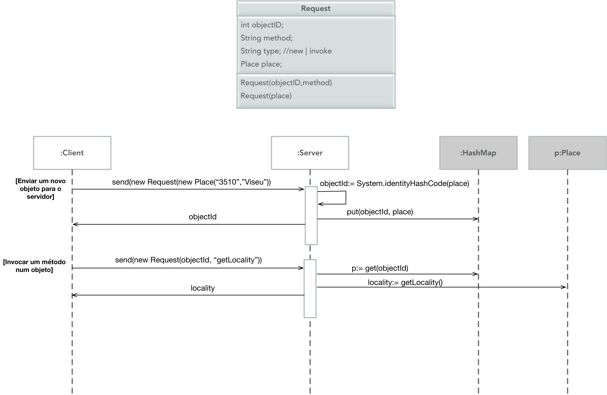

# TCP
Simple Java program that uses streams to comunicate.
This solves UDP problems more effectively.

I follow this workflow.

### Prerequisites
- Should work in most Java versions

### How to use
- Open up command prompt / terminal
- Navigate to location of folder
- Compile it
- Run it by typing "Program_Name_Given_After_Compile"

Note: This program has no GUI. It is build to be used via command prompt / terminal

### *Project by Breno Salles*
